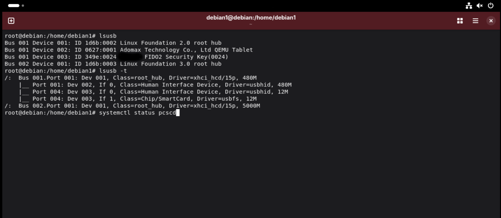
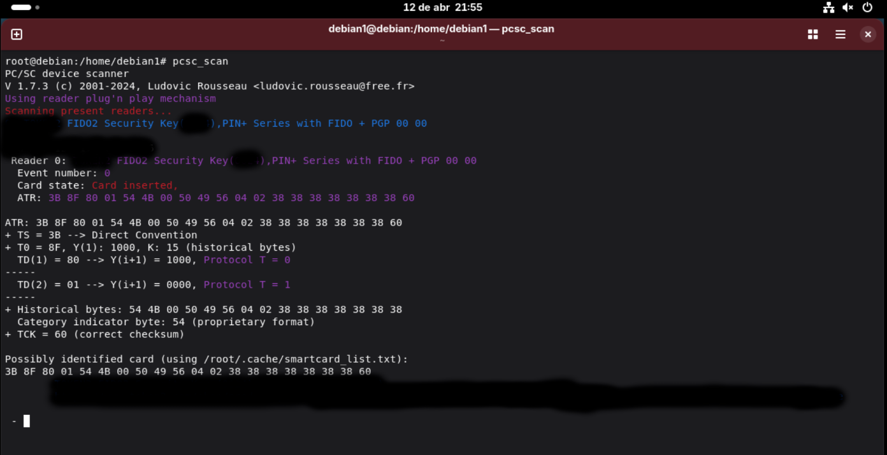
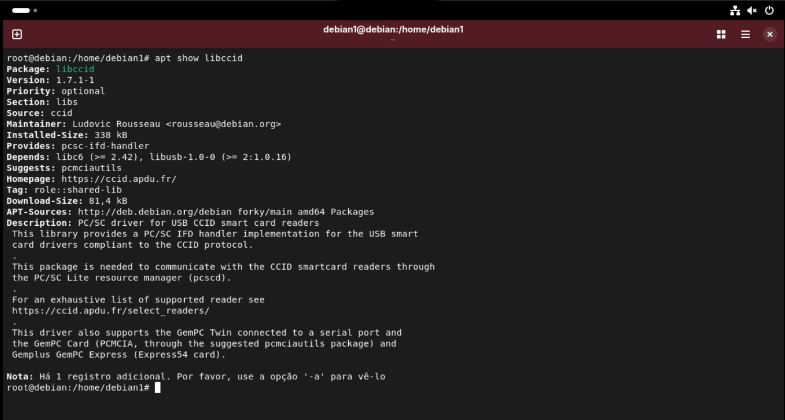
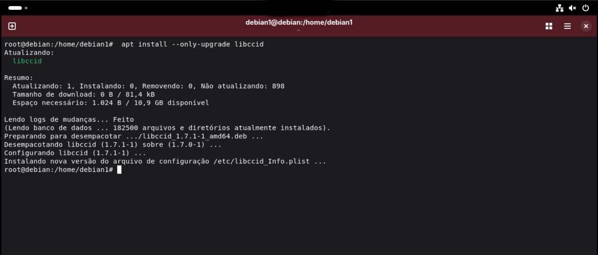
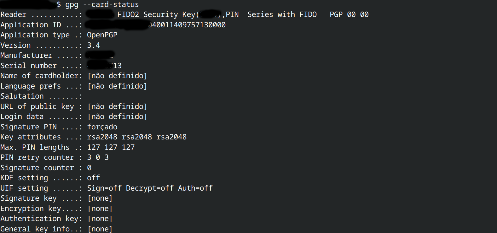
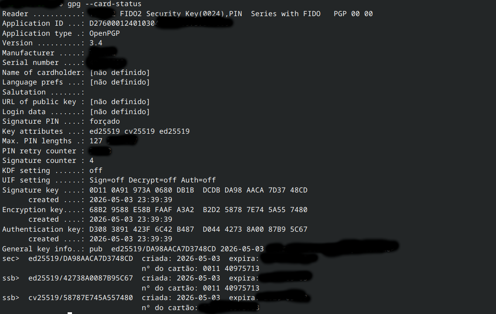

Fido2 OpenPGP Smartcard Setup on Linux (Fedora & Debian)

This guide documents the full setup process for using a FIDO2 device as an OpenPGP smartcard on Linux.
It includes dependency fixes, smartcard detection, GPG configuration, and key creation.


## Requirements

- GnuPG installed
- pcscd service available
- FIDO2 device connected via USB


## Step 1 — Install base packages

### Fedora

```bash
sudo dnf install gnupg pcsc-lite pcsc-tools ccid
```

### Debian / Ubuntu

```bash
sudo apt install gnupg pcscd pcsc-tools libccid
```


## Step 2 — Enable smartcard service

### Fedora (recommended)

```bash
sudo systemctl enable --now pcscd.socket
```

### Alternative (generic)

```bash
sudo systemctl start pcscd
sudo systemctl enable pcscd
```


## Step 3 — Verify USB device  detection

### Plug in your device and check if it is detected at the USB level:

```bash
lsusb
```

Expected output:
 
 

# The smartcard device should apper in the list. 


## Step 4 — Test smartcard detection

Plug in your FIDO2 device and run:

```bash
pcsc_scan
```



You should see the device being detected.

If nothing appears, check:
- The device is connected
- pcscd is running
- The CCID driver is installed

# Note: 
Output may differ before and after OpenPGP initialization (PIN setup and key genereration)


## Step 5 — Check CCID version (important)

Some Linux distributions ship outdated CCID versions that may break FIDO2 OpenPGP support.

Affected systems:
- Fedora 41 / 42
- Debian stable

These may include CCID 1.6.x, which can cause issues.

### Check installed version

Fedora:
```bash
rpm -q ccid
```

Debian:
```bash
dpkg -l | grep ccid
```





## Step 6 — Fix CCID version (Fedora workaround)

Install a newer CCID version from a newer repository:

```bash
sudo dnf install ccid --releasever=43
```




Reboot after installation:

```bash
sudo reboot
```


## Step 7 — Confirm smartcard is working

After reboot:

```bash
pcsc_scan
```

Then:

```bash
gpg --card-status
```



You should now see smartcard details instead of:
"No smartcard available"


## Step 8 — Initialize OpenPGP card

Using a GUI tool like Kleopatra:

- Set User PIN
- Set Admin PIN
- Set PUK

⚠ Write them down on paper. Do NOT store digitally.


## Step 9 — Generate GPG keys on hardware

Using Kleopatra:

- Create a new OpenPGP key directly on the smartcard

Verify:

```bash
gpg --card-status
```



# Note:
# Output may vary dependig on the configured keys and smartcard state.

You should see fingerprints for:
- Signature
- Encryption
- Authentication


## Troubleshooting

### GPG does not detect the smartcard

Restart the smartcard daemon:

```bash
gpgconf --kill scdaemon
sudo systemctl restart pcscd
```

Then try again:

```bash
gpg --card-status
```


### Device detected by lsusb but not by GPG

This usually indicates a communication issue between scdaemon and pcscd.

### Fix:

```bash
gpgconf --kill scdaemon
sudo systemctl restart pcscd
```


## Final Result

✅ FIDO2 is fully working as an OpenPGP smartcard
✅ GPG can access keys stored in hardware
✅ Secure cryptographic operations enabled
