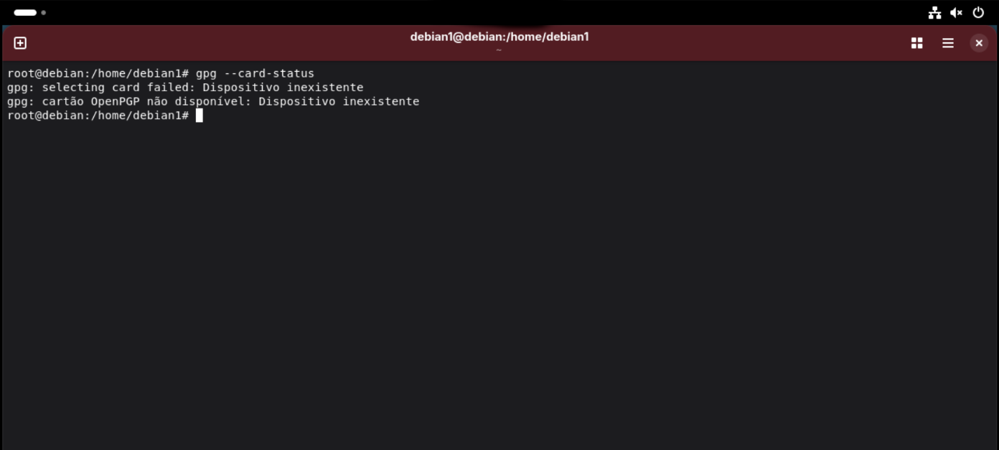
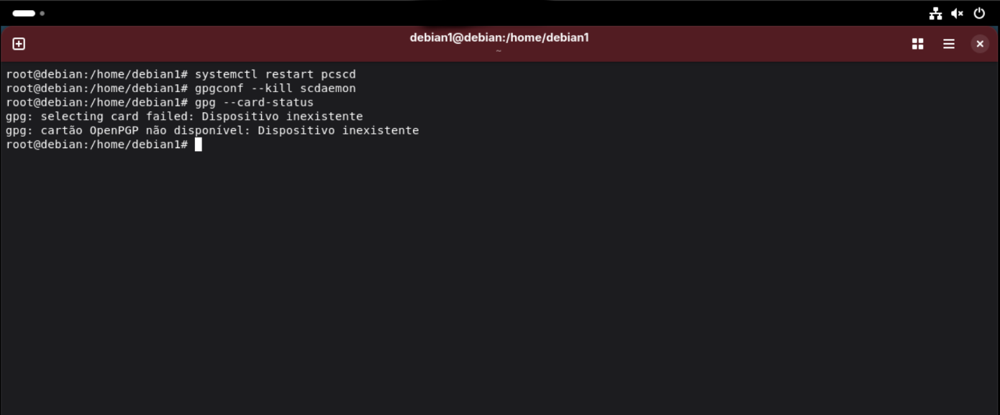
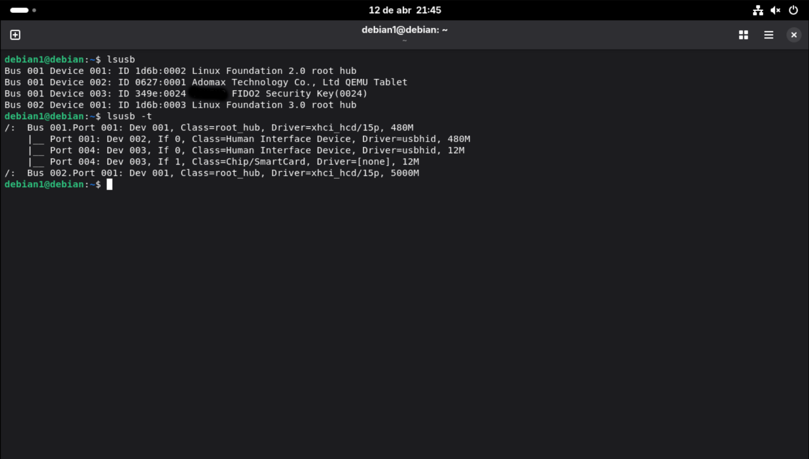

## GPG Smartcard Troubleshooting (FIDO2 OpenPGP)

This document lists common problems encountered when using FIDO2 devices as OpenPGP smartcards on Linux and how to fix them.

---

## Issue 1 — No smartcard available

### Symptoms

```bash
gpg --card-status
```





Returns:

```bash
gpg: selecting card failed: No smartcard available
```

### Causes

- pcscd service not running
- outdated CCID driver
- scdaemon issues

### Fix

Try restarting services:

```bash
sudo systemctl restart pcscd
gpgconf --kill scdaemon
```

 


👉 If the issue persists, verify your setup:
See: [setup/install.md](../setup/install.md)

---

## Issue 2 — pcsc_scan shows nothing

### Symptoms

```bash
pcsc_scan
```


### Note:
### If no device is detected, pcscd_scan will continue runnig without showing any device or smartcard information 

No output when device is connected.

### Causes

- CCID missing or broken
- USB permission issues
- pcscd not running

### Fix

```bash
sudo systemctl start pcscd
```

👉 If still not detected:
- Reconnect the FIDO2 device
- Verify dependencies in install guide:
[setup/install.md](../setup/install.md)

---

## Issue 3 — gpg --card-status hangs or freezes

### Causes

- scdaemon stuck
- corrupted smartcard cache

### Fix

```bash
gpgconf --kill scdaemon
sudo systemctl restart pcscd
```

👉 If the issue continues, review full setup:
See: [setup/install.md](../setup/install.md)

---


## Issue 4 - Device not detected by lsusb


### Symptoms
```bash
lsusb
```

# The Smartcard device not apper in the list:



### Causes

- Device not properly connected
- USB port issue
- Hardware not recognized by the system 

# Fix

- Reconect the device 
- Try a different USB port
- Check system log:

```bash
dmesg | grep -i usb
```

👉 If the device is still not detecded, verify your system setup:
See: [setup/install.md](../setup/install.md)

# ---


## Notes

- Always ensure your system is using a compatible CCID version
- Fedora and Debian may ship outdated versions
- Reboot can help in persistent issues

